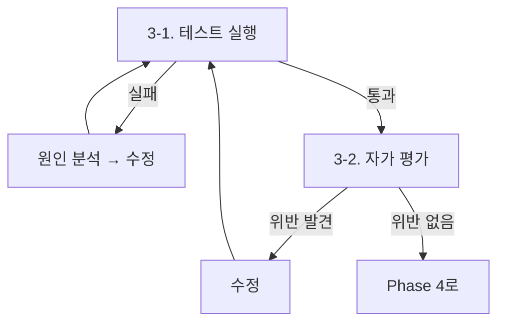

테스트를 작성하거나 수정할 때 아래 4-Phase 워크플로우를 따른다.

---

## Phase 0: 규칙 로드

이 스킬의 `references/rules.md`를 Read로 읽는다. 이후 모든 Phase에서 이 규칙을 따른다.

---

## Phase 1: 대상 분석

`$ARGUMENTS` 처리:
- 인자가 있으면 해당 클래스/파일을 테스트 대상으로 사용한다
- 인자가 없고 자동 호출이면 현재 대화 맥락(직전에 작성/수정한 코드)에서 대상을 추론한다
- 인자가 없고 `/eval-test`로 수동 호출이면 사용자에게 대상을 확인한다

1. 테스트 대상 코드를 읽는다
2. **코드 유형을 분류**한다 (rules.md §1 참조):
   - 도메인 모델 → 단위 테스트 집중
   - 컨트롤러 → 통합 테스트 happy path만
   - 사소한 코드 → 테스트 안 함 (사용자에게 이유 설명)
   - 과도하게 복잡한 코드 → 리팩터링을 권고하고 **워크플로우를 중단**한다
3. 기존 테스트가 있으면 읽어서 현황 파악. 규칙 위반 테스트가 발견되면:
   - 같은 파일 내 위반 → 이번 작업에서 함께 수정
   - 다른 파일의 위반 → Phase 4 보고에서 언급만 (수정은 사용자 판단에 맡김)
4. 사용자가 `/eval-test`로 직접 호출한 경우: 분류 결과와 테스트 전략을 보고 후 진행. 자동 호출된 경우: 보고 없이 바로 Phase 2로 진행

> **사소한 코드로 분류된 경우**: 테스트를 작성하지 않고 이유를 설명한다. 사용자가 명시적으로 요청하면 작성하되, 가치가 낮음을 안내한다.

---

## Phase 2: 테스트 작성

Phase 1에서 테스트 대상으로 분류된 코드에 대해, rules.md의 규칙을 따라 작성한다:

- §3 테스트 스타일 우선순위를 지킨다 (출력 > 상태 > 통신)
- §4 통합 테스트는 가장 긴 happy path 하나 + 비즈니스 규칙 단위만
- §5 mock은 unmanaged dependency에만
- §6 구조 규칙 (이름, GWT, fixture, DI)을 따른다

이 Phase에서는 코드 작성만 한다. 실행은 Phase 3에서 수행한다.

---

## Phase 3: 검증 루프

테스트를 실행하고, 자가 평가하고, 문제가 있으면 수정하는 루프를 **모든 점검을 통과할 때까지** 반복한다.



### 3-1. 테스트 실행

```bash
./gradlew :{module}:test
```

- 컴파일 에러 → 코드 수정 후 재실행
- 테스트 실패 → 실패 원인 분석 후 테스트 또는 프로덕션 코드 수정 → 재실행
- 전체 통과 → 3-2로 진행

### 3-2. 자가 평가

rules.md §7의 5단계를 수행한다. 각 점검에서 **해당 코드를 실제로 나열하고 판단**한다.

- 위반 항목 발견 → 코드 수정 → 3-1로 돌아가 재실행
- 위반 없음 → Phase 4로 진행

---

## Phase 4: 보고

사용자가 `/eval-test`로 직접 호출한 경우, 아래 형식으로 상세 보고한다:

```
## 테스트 결과

| 테스트 | 코드 유형 | 스타일 |
|--------|-----------|--------|
| `재동기화 시 이전 데이터를 교체한다` | 컨트롤러 | 상태 기반 |
| `보너스 조합이 없으면 기본 레벨을 반환한다` | 도메인 모델 | 출력 기반 |

### 테스트하지 않은 코드
- `XxxFactory.from()` — 필드 매핑만 하는 사소한 코드
```

자동 호출된 경우: 테스트 통과 여부와 작성한 테스트 수만 한 줄로 보고한다.
